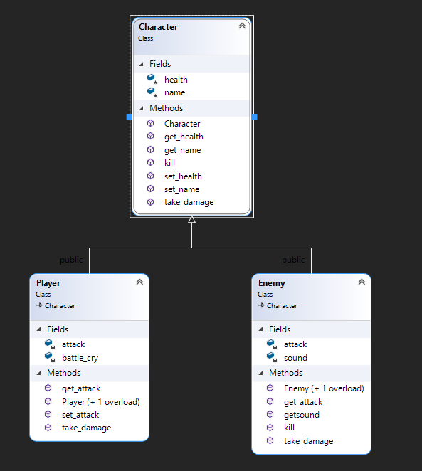

# Simple Text-Based RPG
This is a simple text based RPG provided as a supplement to the main project listed below. Its purpose is to demonstrate the various requirements that cannot be demonstrated in the original project.

## Demonstration
[Demonstration](https://youtu.be/IaJcbSEh8xc)

## Documentation
[Doxygen](https://thegamerdude1010.github.io/COP3003-SupplementalProgram/html/)

## Diagrams

## Getting Started
To run the program, download the .zip file, unzip it, and open the .sln file in Visual Studio. Once it is open, press F5 to run with the debugger or ctrl+F5 to run without the debugger.

## Built With
The app was created using C++ in Visual Studio 2019.

## Author
Jacob Holmes

## License
The code in this project is licensed under the MIT License. [License](LICENSE)

## Acknowledgements
Professor Scott Vanselow.
  https://stackoverflow.com/questions/11523569/how-can-i-avoid-char-input-for-an-int-variable
  https://www.fluentcpp.com/2021/04/16/trailing-return-types/
  https://www.codesdope.com/cpp-stdarray/
  https://appdividend.com/2019/07/15/type-conversion-in-cpp-tutorial-with-example/

## Comparing the Procedural and Object-Oriented Approaches
Procedural programming uses functions that can be called at any time, which are used to manipulate data called variables. In procedural programming, functions are not easily reused or modified. Object-Oriented programming (OOP) uses classes and objects, which allows the code to be reused or modified without significant effort using inheritance. Inheritance allows subclasses to inherit members and functions of a base class. Since any function can be used to modify data, there is a lack of security when using procedural programming. Procedural programming uses scope to define where data and variables can be used, but there is no way to explicitly protect data from functions. On the other hand, OOP uses encapsulation and access specifiers to control access to data, allowing the programmer to restrict access to data. In OOP, a programmer can restrict access to variables so only the methods of the same class or its subclasses can be used to modify the data. Object-oriented programming allows for polymorphism, where methods can be redefined in subclasses so the programmer does not have to rewrite it in the base class. In procedural programming, functions can only be defined once, which means it must be modified everytime features need to be added. Even though OOP seems to be better, procedural programming is still used in conjuction with OOP.

## Relationship between Inheritance and Subtyping (LO5)
Inheritance and subtyping are similar but different concepts. Inheritance lets a subclass use members and methods of its superclass depending on supplied access specifiers. A class that inherits another class can use the members within the superclass without special methods. Subtyping is the idea that a subtype can be used in place of a supertype. When something expects a supertype, it can be downcast to use the subtype. This can be referred to as dynamic dispatch, where determines whether to use the supertype or any of its subtypes at run time. They are similar because a subclass may inherit a virtual function, then override it. Then the subclass's override could be used in place of the superclass's original definition using dynamic dispatch.

## Key Programming Concepts Utilized (LO4)
This program integrates the concepts of object oriented programming, such as inheritance and encapsulation. Inheritance allows the user to reuse code in other places without having to rewrite it.
  Polymorphism and Dynamic dispatch is briefly used to demonstrate the concept. Polymorphism allows programmers to override functions in a base class within a subclass. Dynamic dispatch allows for selecting which version of a method is called at runtime.

## Original Project
The original project is a game created from a tutorial. See details in the repository found here: https://github.com/Thegamerdude1010/RubysAdventure-COP3003Project
