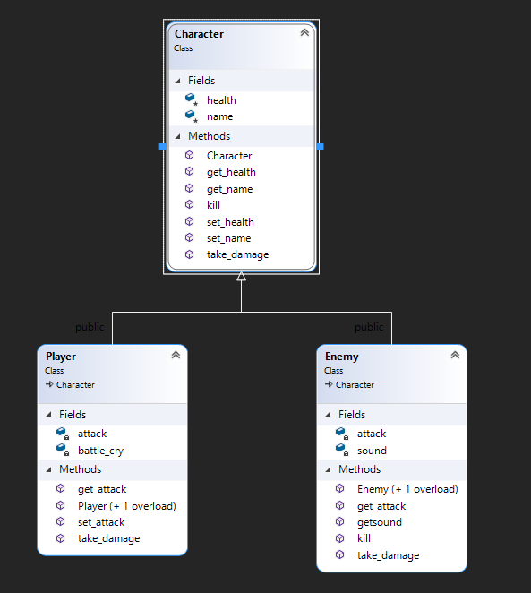

# Simple Text-Based RPG
This is a simple text based RPG provided as a supplement to the main project listed below. Its purpose is to demonstrate the various requirements that cannot be demonstrated in the original project.

## Demonstration

## Documentation

## Diagrams

## Getting Started
To run the program, download the .zip file, unzip it, and open the .sln file in Visual Studio. Once it is open, press F5 to run with the debugger or ctrl+F5 to run without the debugger.

## Built With
The app was created using C++ in Visual Studio 2019.

## Author
Jacob Holmes

## License
The code in this project is licensed under the MIT License. [License](LICENSE)

## Acknowledgements
Professor Scott Vanselow.
  https://stackoverflow.com/questions/11523569/how-can-i-avoid-char-input-for-an-int-variable

## Original Project
The original project is a game created from a tutorial. See details in the repository found here: https://github.com/Thegamerdude1010/RubysAdventure-COP3003Project
